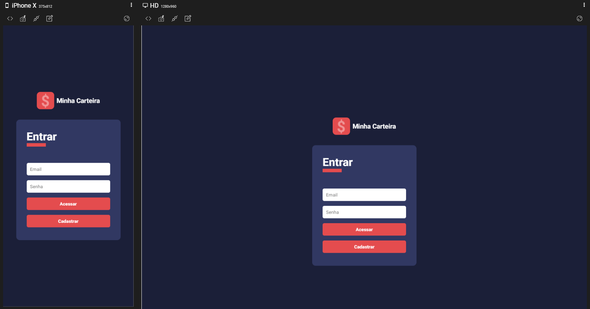
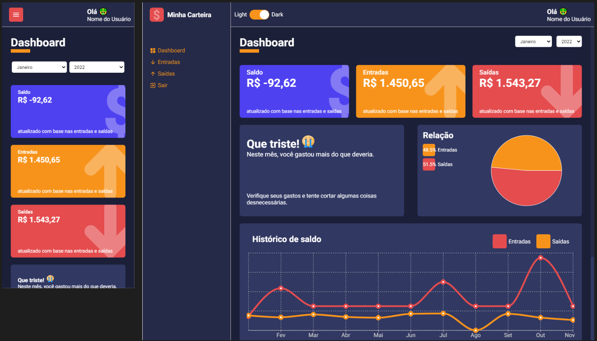
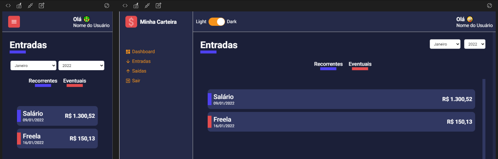
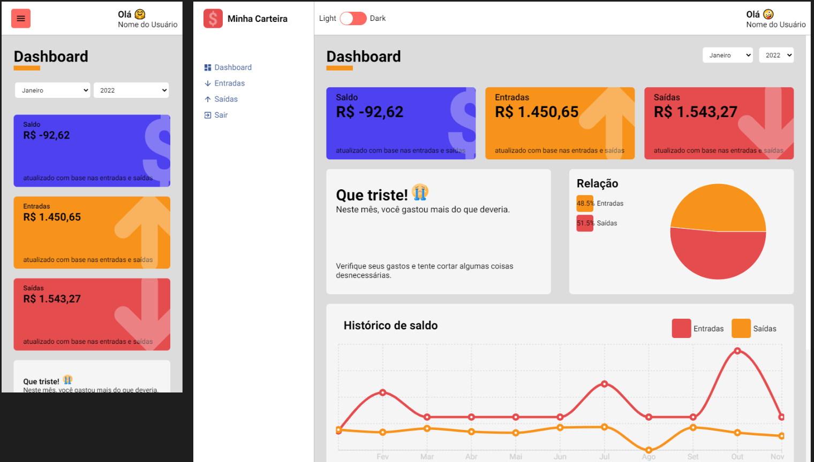

# Minha-Carteira

É um projeto desenvolvido conforme o curso [React e typeScript: desenvolvendo um dasbhoard](https://www.udemy.com/course/react-e-typescript/).

Consiste em um app para controle financeiro pessoal/familar. Por enquanto ainda não é possível inserir dados, mas essa funcionalidade será implementada futuramente.

Possui as seguintes telas:
- Login
- Dashboard
- Entradas
- Saídas

Os prints a seguir mostram a tela mobile na esquerda e a tela desktop na direita.

[Link para acesso ao app](https://francomoraes.github.io/dashboard-minha-carteira/)

## Tela de entrada
Nesta é possível clicar no botão para cadastro e será direcionado à tela de cadastro, porém a tela é somente visual. A implementação funcional será feita futuramente.
É necessário inserir as credenciais email: "nome@email.com" e senha: "123" para ter acesso ao dashboard.

## Infográficos
Apresenta os valores e gráficos conforme os arquivos de json de banco de dados na pasta "repositories". Será implementada integração com banco de dados posteriormente. Foi utilizada a biblioteca react-countup para fazer animação dos números e a biblioteca animation para animação dos cards ao carregar a página.

Os gráficos são alterados conforme o mês e ano selecionado. A data escolhida é mantida ao alterar ou recarregar a tela, devido armazenamento em localStorage.

## Telas entrada e saída
Apresenta os valores conforme os arquivos de json de banco de dados na pasta "repositories". Será implementada integração com banco de dados posteriormente. 
Nessas telas é possível filtrar a exibição por lançamentos recorrentes ou eventuais ao clicar nos botões disponíveis.
Os valores são alterados conforme o mês e ano selecionado. A data escolhida é mantida ao alterar ou recarregar a tela, devido armazenamento em localStorage.
### Entradas

### Saídas

## Tema claro e escuro
Foi utilizada a biblioteca react-switch para implementar o botão de troca de tema, e a propriedade localStorage para armazenar o tema escolhido pelo usuário. É possível fazer logout e login novamente que o tema será mantido.

### Tema claro

## Implementações futuras
- Funcionalidade de cadastro e login;
- Integração com banco de dados;
- Opção de inserção de dados;

## Tecnologias Utilizadas
- Typescript
- React
- Styled-components
- React-router-dom
- Recharts
- React-icons
- React-switch
- localStorage
- React-countup
- Create-react-app
- VSCode
- Responsively

## Author

Franco Moraes

 [GitHub](https://github.com/francomoraes)  
 [LinkedIn](https://www.linkedin.com/in/francomoraes/)
